<!-- BANNER -->
<p align="center">
  
</p>

<!-- AVATAR -->
<p align="center">
  
</p>

<!-- TYPING ANIMATION -->
<p align="center">
  
</p>

<p align="center">
  <a href="https://www.linkedin.com/in/g%C3%A9d%C3%A9on-banyi-9394752b9"></a>
  <a href="mailto:gbelsalvador6@gmail.com"></a>
  <a href="https://gbelsalvador.github.io/portfolio/"></a>
  <a href="https://www.instagram.com/@gbelsalvador"></a>
</p>

<p align="center">
  
  
  
  
  
</p>

---

## 👋 About Me

I'm **Gédéon Banyi**, a PHP & Python backend developer and data scientist based in **Kinshasa, DR Congo 🇨🇩**. I design scalable backend architectures, train machine learning models for real-world problems, and tinker with embedded systems and electronics on the side.

My work sits at the intersection of **clean backend engineering** and **applied AI** — from predicting malaria outbreaks with computer vision, to using reinforcement learning to ease traffic congestion in Kinshasa's streets.

- 🧠 Data Science & Machine Learning for real-world impact (health, mobility, language)
- ⚙️ Backend engineering with strong architecture discipline (MVC, PHP, FastAPI, Django)
- 🔌 Embedded systems & electronics as a passion project
- 🌍 Focused on solutions relevant to Africa: local languages, local infrastructure, local challenges
- 🚀 Currently exploring LLMs, AI agents & RAG systems

---

## 🚀 Currently Building

- 🦟 **malaria-IA** — computer vision model for malaria prediction, served as a Flask web app
- 🚦 **kinshasa-traffic-rl / sumo_ia_roulage** — reinforcement learning for adaptive traffic-light control
- 💞 **ValentineAI** — an emotionally-aware AI companion
- 🧩 **archictecture-MVC-libraries** — my reusable PHP MVC architecture
- 🔄 **data-transformer** — a PHP library for converting data between formats

---

## 🧠 Tech Stack

<p align="center">

</p>

**AI / Data Science:** PyTorch • TensorFlow • Scikit-Learn • OpenCV • Hugging Face • LangChain • NumPy • Pandas
**Backend:** PHP (MVC) • Laravel • FastAPI • Django • REST APIs
**Embedded & Electronics:** Arduino • C/C++ • Sensors & microcontrollers

### 🛠 Daily Tools
VS Code • Docker • Postman • Git • Linux • Jupyter • Notion

---

## 📈 My Journey

```text
2023 → Backend Development (PHP, MVC architecture)
2024 → Data Science & Machine Learning
2025 → Deep Learning, Computer Vision & Reinforcement Learning
2026 → LLMs • AI Agents • RAG • Embedded AI
```

---

## 📊 GitHub Analytics

<p align="center">


</p>

> ⚙️ *Ces deux cartes sont générées automatiquement chaque jour par GitHub Actions et stockées dans ce repo (`/profile/`) — elles ne dépendent plus du serveur public vercel.app et ne peuvent donc plus casser.*

<p align="center">
  
</p>

<p align="center">
  
</p>

<p align="center">
  
</p>

---

## 🌟 Featured Projects

| Projet | Description | Stack |
|---|---|---|
| 🦟 [**malaria-IA**](https://github.com/Gbelsalvador/malaria-IA) | Modèle de vision par ordinateur pour la prédiction du paludisme, exposé via une app Flask | Python • Flask • CV |
| 🚦 [**kinshasa-traffic-rl**](https://github.com/Gbelsalvador/kinshasa-traffic-rl) | Contrôle adaptatif des feux de circulation par apprentissage par renforcement | Python • RL |
| 🚗 [**sumo_ia_roulage**](https://github.com/Gbelsalvador/sumo_ia_roulage) | Simulation de trafic urbain avec SUMO couplée à de l'IA | Python • SUMO |
| 💞 [**ValentineAI**](https://github.com/Gbelsalvador/ValentineAI) | Compagnon IA à intelligence émotionnelle | Python • NLP |
| 🧩 [**archictecture-MVC-libraries**](https://github.com/Gbelsalvador/archictecture-MVC-libraries) | Architecture MVC réutilisable en PHP | PHP |
| 🔄 [**data-transformer**](https://github.com/Gbelsalvador/data-transformer) | Librairie PHP de conversion de données entre formats | PHP |

> 💡 *Table markdown utilisée ici plutôt que des cartes générées par API externe (github-readme-stats), ce service public étant actuellement instable/rate-limité et affichant souvent des images cassées.*

---

## 🧭 Current Focus

```text
- Large Language Models (LLMs)
- AI Agents & RAG Systems
- Reinforcement Learning for infrastructure problems
- Embedded AI on microcontrollers
- Clean backend architecture & system design
```

---

> *"Build. Break. Learn. Repeat."*

---

## 🌐 Connect With Me

<p align="center">
  <a href="https://www.linkedin.com/in/g%C3%A9d%C3%A9on-banyi-9394752b9"></a>
  <a href="mailto:gbelsalvador6@gmail.com"></a>
  <a href="https://gbelsalvador.github.io/portfolio/"></a>
</p>

## 👀 Profile Views

<p align="center">
  
</p>

<p align="center"><b>⚡ "Code is not just about solving problems; it's about creating possibilities." ⚡</b></p>